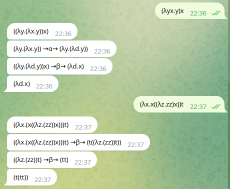
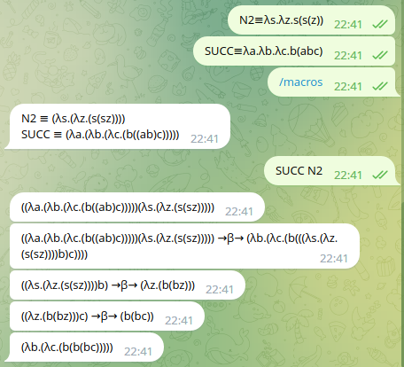
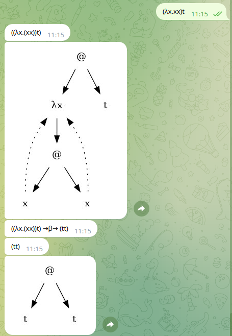

# L'intèrpret de λ-càlcul AChurch

Aquesta pàgina descriu la pràctica de GEI-LP (edició 2022-2023 Q2). La vostra feina consisteix en implementar un petit intèrpret de λ-càlcul anomenat AChurch. 


## Alonzo Church

Alonzo Church (1903-1995) fou un matemàtic, lògic, informàtic i filòsof conegut entre altres coses per la tesi Church-Turing i el λ-càlcul. Està considerat un dels fundadors de la informàtica.

## Tasca 1: la gramàtica

El λ-càlcul és un model computacional basat en *variables* i dues operacions bàsiques: l'*aplicació* i la *composició*. Tota la gramàtica estarà basada en *termes*. Així, les produccions de la gramàtica hauran de contenir:

```
terme  →  lletra  |  ( terme )  |  abstracció  |  aplicació
aplicació  →  terme  terme
abstracció  →  λ  lletra  .  terme
```

Alguns exemples de termes vàlids són:

```
x
xy
λx.xy
(λy.x(yz))(ab)
```

Volem que l'intèrpret accepti el caràcters `\` o `λ`per codificar la lambda de les abstraccions per facilitar l'entrada de dades. Així les expressions següents són equivalents:

```
λx.y
\x.y
```

Les abstraccions poden tenir més d'un paràmetre. Així les expressions següents són equivalents:

```
λxy.z
λx.λy.z
```

Les variables es codifiquen amb una única lletra minúscula per motius estètics. Així, el terme `xy`correspon a l'aplicació del terme `x`sobre el terme `y`.

Això fa que només puguem tenir 26 variables en el nostre entorn per motius simplement estètics. En un intèrpret més gran podríem acceptar noms de variables usuals en els llenguatges de programació per no tenir aquesta limitació.

## Tasca 2: el visitador

Els objectius d'aquesta segona tasca són:

- crear un visitador que converteixi l'AST en un arbre semàntic que representi l'expressió λ-càlcul

- implementar una funció que mostri l'arbre semàntic parentitzat

Alguns exemples d'execució són:

```
? (λy.x(yz))(ab)
Arbre:
((λy.(x(yz)))(ab))

? (λx.x((λz.zz)x))t
Arbre:
((λx.(x((λz.(zz))x)))t)

? (λx.(xx))(λx.(xx))
Arbre:
((λx.(xx))(λx.(xx)))
```

On el `?`correspon al prompt per demanar l'entrada i el que hi ha a continuació seria l'arbre parentitzat. 

Per representar l'arbre semàntic heu d'utilitzar els tipus algebraics de python mitjançant el `dataclass` de la llibreria `dataclasses`. A continuació teniu un exemple del seu funcionament:

```python3
from __future__ import annotations
from dataclasses import dataclass

class Buit:
    pass

@dataclass
class Node:
    val: int
    esq: Arbre
    dre: Arbre

Arbre = Node | Buit

def mida(a: Arbre) -> int:
    match a:
        case Buit():
            return 0
        case Node(x, e, d):
            return 1 + mida(e) + mida(d)

t = Node(1,Node(2,Buit(),Buit()),Node(3,Buit(),Buit()))

print('mida:', mida(t))
```

El resultat d'aquest script és 3.

## Tasca 3: avaluador

L'objectiu d'aquesta tasca es implementar una funció que sigui capaç d'avaluar un terme de λ-càlcul seguint l'estratègia d'ordre de reducció **normal**. En el procés d'avaluació ha d'anar mostrant quines regles (β-reduccions i α-conversions) es van aplicant per assolir l'objectiu. L'objectiu principal és aplicar β-reduccions a les aplicacions que tinguin com a primer terme una abstracció.

La funció ha de tenir un paràmetre que limiti el nombre de reduccions a un màxim per evitar els casos en que les crides recursives no acaben.

A continuació es mostren alguns exemples comentats que podeu utilitzar com a joc de proves.

#### Exemple 1

En aquest exemple s'ha d'aplicar una β-reducció substituint les `y` del terme esquerre pel terme dret `ab`:

```
? (λy.x(yz))(ab)
Arbre:
((λy.(x(yz)))(ab))
β-reducció:
((λy.(x(yz)))(ab)) → (x((ab)z))
Resultat:
(x((ab)z))
```

#### Exemple 2

En aquest cas s'han d'aplicar dues β-reduccions per avaluar el terme d'entrada:

```
? (λx.x((λz.zz)x))t
Arbre:
((λx.(x((λz.(zz))x)))t)
β-reducció:
((λx.(x((λz.(zz))x)))t) → (t((λz.(zz))t))
β-reducció:
((λz.(zz))t) → (tt)
Resultat:
(t(tt))
```

#### Exemple 3

Aquest exemple serveix per veure si esteu aplicant l'ordre normal. Si apliquéssiu l'ordre de reducció aplicatiu entra en una sèrie de crides infinita.

```
? (λx.a)((λy.yy)(λz.zz))
Arbre:
((λx.a)((λy.(yy))(λz.(zz))))
β-reducció:
((λx.a)((λy.(yy))(λz.(zz)))) → a
Resultat:
a
```

#### Exemple 4

Aquest exemple necessita de l'aplicació d'una α-conversió per avaluar el terme. 

```
? (λyx.y)x
Arbre:
((λy.(λx.y))x)
α-conversió: x → z
(λy.(λx.y)) → (λy.(λz.y))
β-reducció:
((λy.(λz.y))x) → (λz.x)
Resultat:
(λz.x)
```

Els noms de les variables del resultat poden canviar i ser igualment correctes. El terme `(λw.x)` seria equivalent.

#### Exemple 5

Aquest és un exemple de crides recursives infinites.

```
? (λx.(xx))(λx.(xx))
Arbre:
((λx.(xx))(λx.(xx)))
β-reducció:
((λx.(xx))(λx.(xx))) → ((λx.(xx))(λx.(xx)))
β-reducció:
((λx.(xx))(λx.(xx))) → ((λx.(xx))(λx.(xx)))
β-reducció:
((λx.(xx))(λx.(xx))) → ((λx.(xx))(λx.(xx)))
...
Resultat:
Nothing
```

En acabar el nombre de crides màxim, la funció hauria d'acabar i mostrar que no es pot resoldre o que s'ha arribat al límit màxim de β-reduccions.

#### Exemple 6

La taula següent mostra la forma de codificar en λ-càlcul els literals booleans i l'operador *not*:

| nom   | λ-càlcul           |
| ----- | ------------------ |
| true  | λxy.x              |
| false | λxy.y              |
| not   | λa.a(λbc.c)(λde.d) |

L'exemple avalua l'expressió `not true`:

```
? (λa.a(λbc.c)(λde.d))(λxy.x)
Arbre:
((λa.((a(λb.(λc.c)))(λd.(λe.d))))(λx.(λy.x)))
β-reducció:
((λa.((a(λb.(λc.c)))(λd.(λe.d))))(λx.(λy.x))) → (((λx.(λy.x))(λb.(λc.c)))(λd.(λe.d)))
β-reducció:
((λx.(λy.x))(λb.(λc.c))) → (λy.(λb.(λc.c)))
β-reducció:
((λy.(λb.(λc.c)))(λd.(λe.d))) → (λb.(λc.c))
Resultat:
(λb.(λc.c))
```

## Tasca 4: macros

En aquesta tasca es demana que modifiqueu la gramàtica i l'script per tal de poder definir i usar macros (o combinadors) dins l'intèrpret. Haureu de:

- Ampliar la gramàtica per permetre avaluar un terme o definir una macro

- Ampliar la gramàtica per a que un terme pugui ser el nom d'una macro

- Guardar una taula de macros definides

- Quan aparegui una macro en un terme, substituïr-lo pel seu terme λ-càlcul equivalent

Els noms de les macros han de començar per una lletra majúscula i poden contenir majúscules i xifres. La forma de definir les macros serà mitjançant els caràcters `≡` o `=`amb notació infixa.

A continuació el mostra l'aplicació amb l'exemple anterior:

```
? TRUE≡λx.λy.x
TRUE ≡ (λx.(λy.x))
? FALSE≡λx.λy.y
TRUE ≡ (λx.(λy.x))
FALSE ≡ (λx.(λy.y))
? NOT≡λa.a(λb.λc.c)(λd.λe.d)
TRUE ≡ (λx.(λy.x))
FALSE ≡ (λx.(λy.y))
NOT ≡ (λa.((a(λb.(λc.c)))(λd.(λe.d))))
? NOT TRUE
Arbre:
((λa.((a(λb.(λc.c)))(λd.(λe.d))))(λx.(λy.x)))
β-reducció:
((λa.((a(λb.(λc.c)))(λd.(λe.d))))(λx.(λy.x))) → (((λx.(λy.x))(λb.(λc.c)))(λd.(λe.d)))
β-reducció:
((λx.(λy.x))(λb.(λc.c))) → (λy.(λb.(λc.c)))
β-reducció:
((λy.(λb.(λc.c)))(λd.(λe.d))) → (λb.(λc.c))
Resultat:
(λb.(λc.c))

? NOT FALSE
Arbre:
((λa.((a(λb.(λc.c)))(λd.(λe.d))))(λx.(λy.y)))
β-reducció:
((λa.((a(λb.(λc.c)))(λd.(λe.d))))(λx.(λy.y))) → (((λx.(λy.y))(λb.(λc.c)))(λd.(λe.d)))
β-reducció:
((λx.(λy.y))(λb.(λc.c))) → (λy.y)
β-reducció:
((λy.y)(λd.(λe.d))) → (λd.(λe.d))
Resultat:
(λd.(λe.d))
```

i un exemple aritmètic:

```
? N2≡λs.λz.s(s(z))
N2 ≡ (λs.(λz.(s(sz))))
? SUCC≡λa.λb.λc.b(abc)
N2 ≡ (λs.(λz.(s(sz))))
SUCC ≡ (λa.(λb.(λc.(b((ab)c)))))
? SUCC N2
Arbre:
((λa.(λb.(λc.(b((ab)c)))))(λs.(λz.(s(sz)))))
β-reducció:
((λa.(λb.(λc.(b((ab)c)))))(λs.(λz.(s(sz))))) → (λb.(λc.(b(((λs.(λz.(s(sz))))b)c))))
β-reducció:
((λs.(λz.(s(sz))))b) → (λz.(b(bz)))
β-reducció:
((λz.(b(bz)))c) → (b(bc))
Resultat:
(λb.(λc.(b(b(bc)))))
```

Com podeu veure, la nostra implementació mostra totes les macros definides en el moment en que definim una nova.

## Tasca 5: macros amb notació infixa

En aquesta tasca heu de permetre la definició de macros amb notació infixa. En aquests cas els noms seran símbols no alfabètics i la seva implementació serà similar a les macros amb notació prefixa. Veieu l'exemple següent:

```
? N2≡λs.λz.s(s(z))
N2 ≡ (λs.(λz.(s(sz))))
? N3≡λs.λz.s(s(s(z)))
N2 ≡ (λs.(λz.(s(sz))))
N3 ≡ (λs.(λz.(s(s(sz)))))
? +≡λp.λq.λx.λy.(px(qxy))
N2 ≡ (λs.(λz.(s(sz))))
N3 ≡ (λs.(λz.(s(s(sz)))))
+ ≡ (λp.(λq.(λx.(λy.((px)((qx)y))))))
? N2+N3
Arbre:
(((λp.(λq.(λx.(λy.((px)((qx)y))))))(λs.(λz.(s(sz)))))(λs.(λz.(s(s(sz))))))
β-reducció:
((λp.(λq.(λx.(λy.((px)((qx)y))))))(λs.(λz.(s(sz))))) → (λq.(λx.(λy.(((λs.(λz.(s(sz))))x)((qx)y)))))
β-reducció:
((λs.(λz.(s(sz))))x) → (λz.(x(xz)))
β-reducció:
((λq.(λx.(λy.((λz.(x(xz)))((qx)y)))))(λs.(λz.(s(s(sz)))))) → (λx.(λy.((λz.(x(xz)))(((λs.(λz.(s(s(sz)))))x)y))))
β-reducció:
((λz.(x(xz)))(((λs.(λz.(s(s(sz)))))x)y)) → (x(x(((λs.(λz.(s(s(sz)))))x)y)))
β-reducció:
((λs.(λz.(s(s(sz)))))x) → (λz.(x(x(xz))))
β-reducció:
((λz.(x(x(xz))))y) → (x(x(xy)))
Resultat:
(λx.(λy.(x(x(x(x(xy)))))))
```

## Tasca 6: AChurch a Telegram

Feu que l'intèrpret *AChurch* funcioni a *Telegram* via la llibreria `python-telegram-bot`.

Haureu d'instal·lar-la fent:

```
pip install python-telegram-bot
```

El bot ha de tenir almenys les comandes: `start`, `author`, `help` i `macros`. A la figura següent teniu un exemple de les tres primeres, l'última es mostrarà en un proper exemple.


La següent en mostra dos exemples d'avaluacions d'expressions:



I la següent un d'ús de macros i la comanda `macros`:



Fixeu-vos en que la macro `macros`mostra un llistat de totes les macros que hi ha definit al sistema.

El bot que hem fet nosaltres utilitza la versió 20.1 del `python-telegram-bot`.

## Tasca 7: representació gràfica dels arbres

En aquesta última tasca heu de fer que es representin gràficament els arbres semàntics, amb la llibreria `pydot`.

Necessitareu instal·lar el següent:

```
pip install pydot
sudo apt install graphviz
```

La figura següent mostra el que s'espera que obtingueu:



Fixeu-vos en que `@` representa la composició i les linies discontinues variables lligades.

Per mostrar les imatges hem generat arxius `png`amb el `pydot` i les hem enviat com si fossin `photos`.

## Llibreries

Utilitzeu  `ANTLR` per escriure la gramàtica i l'intèrpret i `dataclasses`per treballar amb els arbres semàntics. Podeu utilitzar lliurament qualsevol llibreria estàndard de Python. 

# Consells

Per tal de fer la  pràctica, us recomanem de seguir aquests passos:

1. Feu tots els exercicis de laboratori inclosos a https://gebakx.github.io/Python3/compiladors.html#1. Us serà molt útil, de debò.

2. Seguiu l'ordre de les tasques tal i com estan a l'enunciat.

3. En desenvolupar cada tasca, aneu provant que us funcionin els jocs de proves anteriors.

4. Escriviu el README.

5. Si voleu, realitzeu extensions.

Al llarg de tots els passos anteriors, aneu documentant tot allò que no sigui obvi.

Deixeu la feina bruta a l'ANTLR: si feu una bona gramàtica, cadascun dels vostres visitadors serà molt curt i molt senzill. Si els vostres visitadors tenen molta lògica, retoqueu la gramàtica, introduint noves regles i/o etiquetes.

Feu la pràctica "amb carinyo".

# Lliurament

Heu de lliurar la vostra pràctica al Racó. Només heu de lliurar un fitxer ZIP
que, al descomprimir-se generi:

- Un fitxer `README.md` que documenti el vostre projecte.
  |:- vegeu, per exemple, https://www.makeareadme.com/.

- Un fitxer `lc.g4` amb la gramàtica del LP.

- Un fitxer `achurch.py` amb el programa de l'intèrpret, incloent els seus visitadors.

- Res més. De debò, res més. Tampoc directoris. Ni subdirectoris. Ni `.git`s, ni `.MACOS_XXX`... Res més, collons!

Els vostres fitxers de codi en Python han de seguir les regles d'estil PEP8, tot i que podeu oblidar les restriccions sobre la llargada màxima de les lı́nies. Podeu utilitzar els paquets `pep8` o `autopep8` o http://pep8online.com/ per assegurar-vos que seguiu aquestes regles d'estil. L’ús de tabuladors en el codi queda prohibit (zero directe). Els vostres programes en AChurch han de seguir l'estil exposat en aquest document.

El termini de lliurament és el **dimecres 8 de juny a les 13:00**.

Per evitar problemes de còpies, no pengeu el vostre projecte en repositoris públics.

# Referències

- Alonzo Church - Wikipedia: https://en.wikipedia.org/wiki/Alonzo_Church

- ANTLR en Python: https://gebakx.github.io/Python3/compiladors.html#1

- Fonaments: λ-càlcul: https://jpetit.jutge.org/lp/03-lambda-calcul.html

- Lambda calculus - Lambda Calculus: http://www-cs-students.stanford.edu/~blynn/lambda/

- Lambda-Calculus Evaluator: https://www.cl.cam.ac.uk/~rmk35/lambda_calculus/lambda_calculus.html

- Lambda Calculus Interpreter: https://jacksongl.github.io/files/demo/lambda/index.htm

- python-telegram-bot: https://docs.python-telegram-bot.org/en/stable/

- pydot: https://github.com/pydot/pydot
